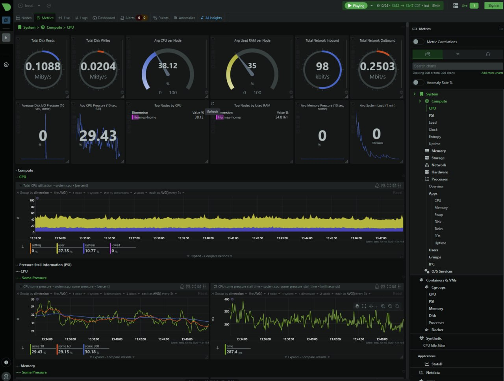

# 5 Dollar SOC

A cheap VPS security lab built around **Hermes Agent**, honeypots, automated threat intel, and real email reporting.

This repository documents a practical homelab / SOC-in-a-box setup used to learn:
- security monitoring
- honeypot operations
- threat intelligence enrichment
- detection engineering
- AI agent automation

## The full write-up

Read the story: **[The $5 SOC: What I Actually Use a Cheap Cloud Server For](docs/the-5-dollar-soc.md)**



## Why this project exists

Most security labs are either:
1. purely theoretical, or
2. too expensive to stay on

This one is different. It is small, scrappy, and intentionally practical.

The point is not to build a production SOC.  
The point is to build **something real enough to learn from every day**.

## What the system does

A $5/month-style VPS runs an AI-managed security stack that:

- deploys honeypots to attract and observe attackers
- collects logs and telemetry automatically
- enriches suspicious IPs and indicators
- emails daily and weekly reports
- forwards inbox traffic to personal email
- tracks operational drift with cron-driven automation

The goal is to create a **loop**:

1. attract traffic
2. capture telemetry
3. enrich / interpret it
4. report it
5. improve the system

## Architecture

See the interactive diagram: [`diagrams/5-dollar-soc-architecture.html`](diagrams/5-dollar-soc-architecture.html)

```text
Attackers / Internet traffic
        |
        v
  [ Public VPS / hermes-home ]
  |  honeypots
  |  firewall / blocklists
  |  threat-intel pipeline
  |  Netdata dashboard
  |  email pipeline
        |
        v
  Hermes Agent
  - runs scripts
  - enriches findings
  - sends reports
  - updates automation
        |
        v
  Operator (Telegram / Email / Gmail forwarding)
```

## What you learn from a build like this

This project is useful because it forces you to work across several real domains at once:

- **blue team operations** — what does attacker traffic actually look like?
- **detection engineering** — what should trigger attention vs noise?
- **threat intelligence** — how do you enrich and prioritize indicators?
- **automation design** — how do you make a system useful without babysitting it?
- **data storytelling** — how do you turn logs into something an operator will actually read?

## Core components

### Hermes Agent
The automation and operator-facing brain. It runs scheduled security tasks, interprets findings, formats reports, and helps keep the system evolving.

### Honeypots
Honeypots expose attractive services to observe attacker behavior, such as:
- SSH
- FTP
- Telnet
- SMB
- database ports
- web admin panels

### Threat intel pipeline
Suspicious activity is enriched with sources like:
- Spamhaus / Tor exit data
- Abuse / threat feeds
- VirusTotal
- IPinfo
- OTX
- local YARA / JA3 / GeoIP data

### Reporting
Operator-facing outputs include:
- daily security brief
- weekly SOC report
- email forwarding
- threat summaries

### Observability
Netdata provides near-realtime visibility for:
- CPU
- memory
- disk
- custom metrics
- operational health

## Suggested repo structure

```text
README.md
LICENSE
.env.example
docs/
examples/
diagrams/
cron/
```

Use this repository as documentation, not as a private config dump.

## Sanitization checklist

Before publishing anything from a real setup, remove or replace:

- API keys
- tokens
- personal email addresses
- real hostnames
- tailscale addresses
- inbox IDs
- public IPs tied to your home / VPS identity
- internal automation names that leak personal info

Use `.env.example` and sanitized YAML examples instead of real configuration.

## Why it works well for students

This project is valuable for learners because it is:

- cheap
- repeatable
- practical
- observable
- easy to extend
- full of real-world feedback loops

A small lab like this can teach more than a large lab you never touch.

## Good follow-on projects

- add a structured incident journal
- create detection rules for your own honeypot data
- build a triage rubric for noisy sources
- add weekly retrospectives to your reports
- turn your findings into blog posts
- publish sanitized detections and writeups

## License

MIT
